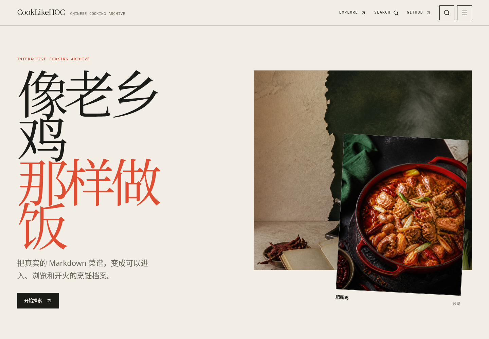

# lxj-cook

基于 [CookLikeHOC](https://github.com/Gar-b-age/CookLikeHOC) 菜谱重做的中文烹饪档案，支持分类浏览、食材搜索、菜谱详情和分步烹饪模式。使用 VitePress + Vue，内容来自仓库中的 Markdown。

本项目与老乡鸡及其官方站点没有隶属或授权关系。

[在线演示](https://cook.xgouo.cn/) · [当前仓库](https://github.com/zhs1234/lxj-cook)

## 预览

线上首页，2026-09-30。



## 本地运行

需要 Node.js 18+ 和 npm。

```bash
git clone https://github.com/zhs1234/lxj-cook.git
cd lxj-cook
npm install
npm run start
```

访问 `http://localhost:5173/`。`npm run start` 与 `npm run docs:dev` 都会先生成内容索引，再启动开发服务器。

```bash
npm run build         # 生成索引并构建，输出到 .vitepress/dist/
npm run docs:preview  # 预览构建结果
npm test              # 运行全部测试
```

单项测试命令见 [`package.json`](./package.json) 中的 `test:*`。

## 修改菜谱

菜谱在根目录的 `炒菜/`、`汤/`、`主食/` 等分类目录中。修改原始 Markdown 和对应图片后，运行 `npm run build` 检查结果。

生成流程为 Markdown → 解析与图片匹配 → `.vitepress/generated/` → 自定义主题。不要手工修改生成数据，也不要补写来源中没有的时长、评分、份量或营养信息。

| 目录 | 用途 |
| --- | --- |
| `.vitepress/scripts/` | 内容解析、图片匹配与索引生成 |
| `.vitepress/theme/` | 页面、组件和样式 |
| `tests/` | 内容、页面和交互测试 |

开发和反馈以本仓库 `main` 为准。提交前运行构建和测试；界面图标使用 Lucide，不使用 Emoji。完整约定见 [`AGENTS.md`](./AGENTS.md)。

## 部署

这是静态网站，不需要 Node.js 常驻进程。在宝塔或其他静态服务器上，将 **`.vitepress/dist/` 内的文件**上传到站点根目录，配置域名与 HTTPS；不要直接公开整个源码仓库。

Nginx 路由回退：

```nginx
location / {
    try_files $uri $uri/ /index.html;
}
```

也可以使用仓库内的 Dockerfile：

```bash
docker build -t lxj-cook:latest -f docker_support/Dockerfile .
docker run -d --name lxj-cook -p 3001:80 lxj-cook:latest
```

访问 `http://localhost:3001/`。

## 来源与致谢

感谢 [Gar-b-age/CookLikeHOC](https://github.com/Gar-b-age/CookLikeHOC) 及其贡献者提供原始菜谱与图片。本仓库是独立重构，不代表原作者的官方项目，也不改变原有内容的归属。菜谱文字、图片等资源的使用边界，以原始仓库和资源自身声明为准。


